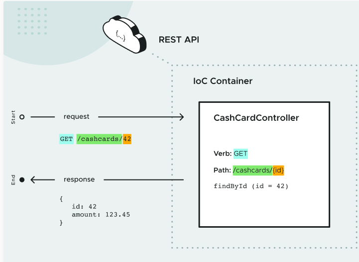

# Approach
  **Test Driven Development**
- Write a failing test
- Use TDD to test a JSON data contract(agreement between the backend and consumer)
- Use TDD to test JSON deserialization
 
**Request - Response working**

( ctrl + alt + v) -> Replace the occurrence of two codes with one