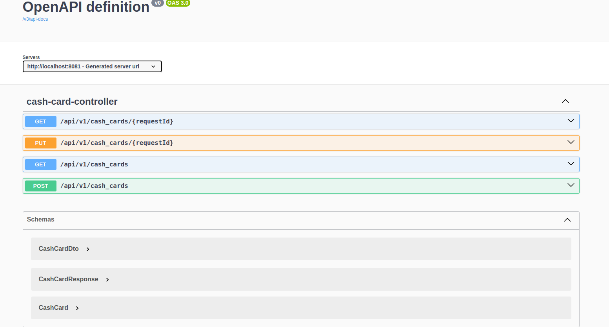

# Approach
  **Test Driven Development**
- Write a failing test
- Use TDD to test a JSON data contract(agreement between the backend and consumer)
- Use TDD to test JSON deserialization
- Impl test using the Mockito Framework - For isolated testing
 
**Request - Response working**

**Important**

- ( ctrl + alt + v) -> Replace the occurrence of two codes with one
- All exceptions handled with correct messages provided to the consumer (Using the power of @ControllerAdvice impl in CustomException handler)

**Swagger**
